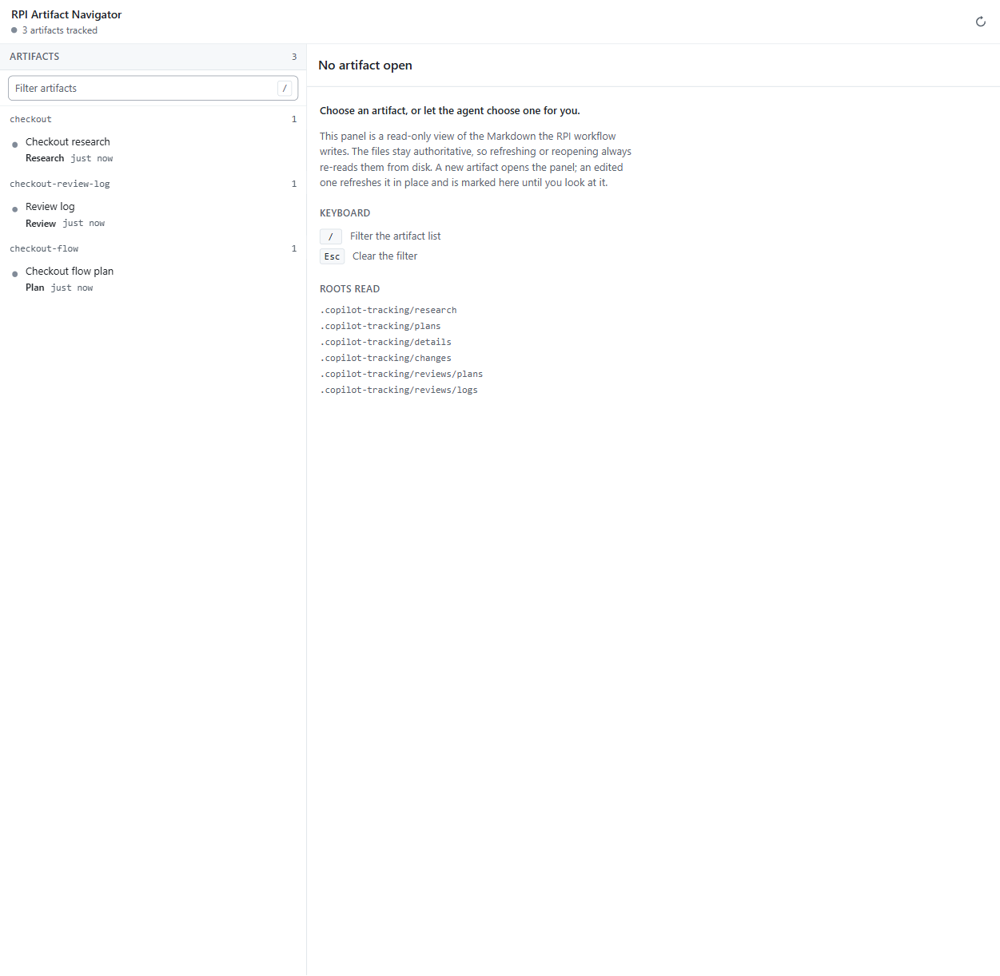
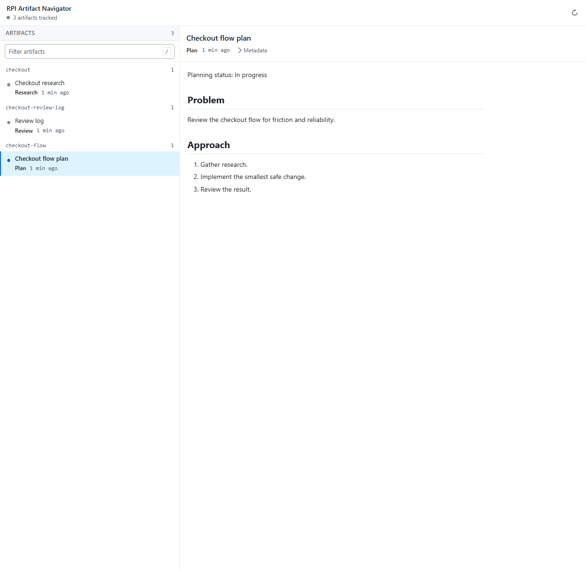
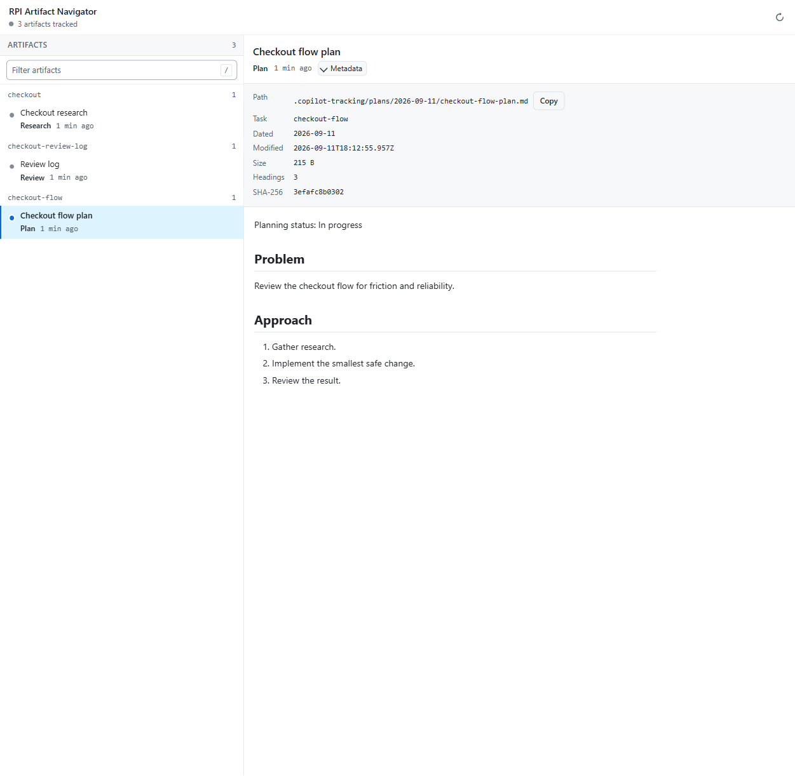

# RPI Artifact Navigator

RPI Artifact Navigator is a read-only GitHub Copilot canvas for browsing
Research-Plan-Implement (RPI) tracking artifacts in the active workspace. It
lists available artifacts, shows derived metadata and heading outlines, and
renders the source Markdown without changing the files on disk.

The navigator is an optional Copilot canvas extension. It is not a standalone
application and is not installed by the `skills.sh` CLI.

## What it reads

The extension reads only Markdown files beneath these workspace-relative roots:

- `.copilot-tracking/research`
- `.copilot-tracking/plans`
- `.copilot-tracking/details`
- `.copilot-tracking/changes`
- `.copilot-tracking/reviews/plans`
- `.copilot-tracking/reviews/logs`

Missing roots produce an empty artifact list. Files outside these roots,
non-Markdown files, symlinked paths, multiply linked files, and path traversal
requests are rejected. The navigator enforces these resource limits:

- 200 artifacts per workspace
- 1 MiB per artifact
- 500 headings per artifact
- 1.5 MiB per response

Titles, statuses, dates, artifact types, task slugs, and heading outlines are
derived from the artifact path and Markdown content. They are navigation
metadata, not authoritative workflow state.

## Features

- Browse and filter the approved RPI artifacts.
- Inspect source text, file size, modification time, SHA-256, title, status,
  type, task slug, and heading outline.
- Select a specific artifact when opening or refreshing the canvas.
- Refresh the current view manually or after an artifact changes.
- Automatically open a task-scoped panel for a newly created artifact after a
  successful agent tool call.
- Refresh an existing task-scoped panel when a tracked artifact changes after a
  successful agent tool call.

Change detection happens around successful agent tool calls; it is not a
general filesystem watcher or real-time synchronization service. Closing a
panel suppresses edit-driven reopening for that task. A newly created artifact
may open a new task-scoped panel.

## Screenshots

The screenshots below show the navigator populated with representative RPI
tracking artifacts.

**Artifact overview**



**Rendered artifact**



**Artifact metadata**



## Installation

### Copilot plugin

The repository distributes the extension with the `agent-plugins` Copilot
plugin:

```bash
copilot plugin marketplace add filipmares/agent-plugins
copilot plugin install agent-plugins@agent-plugins
```

Later updates are delivered with:

```bash
copilot plugin update agent-plugins
```

### Manual Copilot app import

In the GitHub Copilot app, choose **Customize → Extensions → Import canvas from
repo**, select `filipmares/agent-plugins`, and choose
`extensions/rpi-artifact-navigator/`.

A manual import is a one-time copy. It does not receive plugin updates; import
the extension again to pick up later repository changes.

## Support and prerequisites

Use a GitHub Copilot host that supports canvases and provides an active
workspace directory. The extension uses the host-provided Copilot SDK and does
not expose a separate configuration file or command-line entry point.

Canvas support is experimental and has been verified only on macOS with the
GitHub Copilot app. Do not treat that verification as a claim of equivalent
support on other hosts or operating systems.

## Read-only and security model

The navigator does not write, edit, delete, rename, move, or execute artifact
content. Other Copilot tools may still modify the source files; the navigator
can then re-read the changed artifacts.

The rendered document is served from a per-instance loopback server with:

- a random capability path scoped to the canvas instance;
- exact loopback `Host` and optional `Origin` checks;
- no CORS or preflight support;
- restrictive content-security and response headers; and
- no-store responses.

Markdown rendering uses pinned, offline copies of Marked and DOMPurify. Raw
HTML and control comments are removed, images and executable diagrams are not
loaded, task-list inputs remain disabled, and links are displayed as
non-navigating label-and-destination text. If rendering fails, stale content is
cleared and the view presents a retryable read-only error.

These controls describe the implemented trust boundaries; they are not a
guarantee that every host or surrounding workspace is secure.

## Canvas actions

The provider exposes three read-only actions for supported Copilot hosts:

| Action | Purpose |
| --- | --- |
| `list_rpi_artifacts` | List artifacts in the approved roots. |
| `get_rpi_artifact` | Read one artifact, including metadata, headings, and source text. |
| `refresh_rpi_artifacts` | Re-read the approved roots and optionally select an artifact. |

Each action returns structured JSON-compatible data and uses a closed error
taxonomy for invalid requests, unavailable workspaces, resource limits, and
artifact changes.

## Development and validation

From the repository root, run:

```bash
bun run test:canvas
bun run validate:copilot-plugin
```

The canvas tests cover the artifact model, path policy, sanitized rendering,
HTTP routes, capability handling, refresh behavior, and lifecycle cleanup.
Rendering changes also require a macOS GitHub Copilot canvas check for supported
Markdown, hostile input, missing or throwing browser libraries, focus and
refresh behavior, and narrow and wide layouts. Bun assertions do not execute
or attest the final host-rendered DOM.

The extension is intentionally self-contained. Runtime modules use Node's
standard library plus `@github/copilot-sdk`; browser-only dependencies are
vendored and pinned under `vendor/`, with their license notices under
`third-party-licenses/`.
